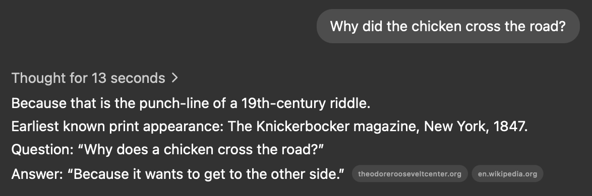
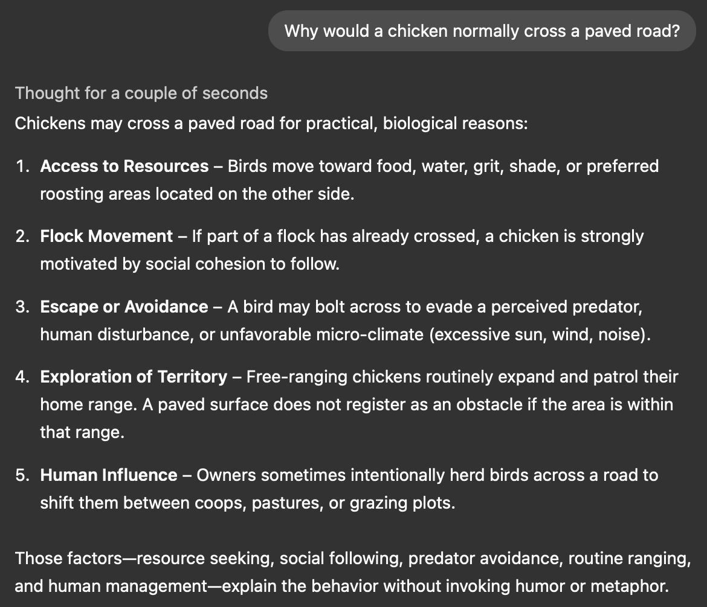

Imagine a bicycle. Visualise its frame, with all its bends, welds, bolts. A steerer tube with handlebars on top, adorned with a gear selector and a brake lever. Brake lever pulling on a cable that pushes the calipers, which clamp the wheels' rims or brake discs. Then the wheels themselves with spokes, tires and an intricate tread on them. A well-oiled chain, which then goes over the rear derailleur. The derailleur with a set of gears with carefully calculated gear ratios in a geometric progression. Magnificently simple, yet [non-trivial mechanism](https://www.science.org/doi/abs/10.1126/science.1201959).

Most likely you'll be able to imagine every detail of it. But can you explain how to _ride_ it?

Unless you actually [researched the physics of it](https://royalsocietypublishing.org/doi/10.1098/rspa.2007.1857), chances are, you wouldn't be able to explain it, even if you've ridden one gazillion of times.

## Tacit Knowledge

Riding a bicycle is the most commonly given example of [tacit knowledge](https://www.amazon.com/Tacit-Dimension-Michael-Polanyi/dp/0226672980), which is a term coined by [Michael Polanyi](https://en.wikipedia.org/wiki/Michael_Polanyi). That is knowledge that stems from experience.

Every time you had an inexplicable feeling for a decision, or a hunch, most likely that's the weights of those connections between neurons talking. Sudden epiphanies of seemingly crazy ideas - that's your brain telling you to try things out based on what you've witnessed or experienced before. And every time you "disable" your brain and rely on muscle memory, you tap into the tacit knowledge.

The opposite of tacit knowledge is explicit knowledge. As the term suggests, it's the kind of structured information and determinate skills that are always available on demand. Something that you'd be able to explain even if you're [woken up in the middle of a night](https://xkcd.com/313/). Such knowledge is queryable by [embeddings](https://www.ibm.com/think/topics/vector-embedding) of the questions that you're posed with, and that is because it was originally embedded in your brain via a well-defined mental model.

The less opinionated an industry is, the less often you resort to Tacit Knowledge. At the beginning of the spectrum, take art - there are hardly any rules you could follow to create a masterpiece, you just "embrace the exponentials" and [let the vibes drive the work](https://arstechnica.com/ai/2025/03/is-vibe-coding-with-ai-gnarly-or-reckless-maybe-some-of-both/). At the other end, take electrical engineering - there are only so many valid ways to wire up a circuit, and all of them can be written down and validated, so you _can_ know exactly what needs to be done to achieve the goal.

_Figure 1. Example of numerous electricians over the years knowing exactly what had to be done._

## Knowledge Boundary

Given that both forms of knowledge have their uses, it's hard to say that either one is better than the other. If your day-to-day job requires muscle memory, then surely you'd prefer to have more experience than specific information about the process. On the other hand, if your goal is analysis and strategic decision-making, then you can hardly get by with _just_ hunches and feelings.

That said, you would probably want to have at least _some_ experience (preferably your own) to guide your strategic decisions. If you're inventing a bicycle, yet you don't have your own experience of riding one, you risk ending up with [penny-farthing](https://en.wikipedia.org/wiki/Penny-farthing). The design seems reasonable given the [requirements](https://en.wikipedia.org/wiki/Penny-farthing#:~:text=In%20addition%2C%20the%20large%20wheel%20gave%20a%20smoother%20ride%2C%5B22%5D%20important%20before%20the%20invention%20of%20pneumatic%20tires.) - that's until you dive head-first into asphalt after hitting the first stone chip on the road.

It might seem that you don't have to rely on experience if you just formalise every step of the decision process. Accepting that would imply that any knowledge could be expressed as an instruction set for an [automaton](https://en.wikipedia.org/wiki/Automata_theory). However, as often the case, there's a wide gap between possibility and feasibility. Surely you can reduce any knowledge to a set of steps and criteria for evaluating results - and yet, how many criteria do you have to evaluate to confidently [tell apart a hare and a rabbit](https://www.treehugger.com/commonly-confused-animals-4869334)? The closer you'd get to full confidence in results, the less practical the implementation would get, [even if theoretically efficient](https://en.wikipedia.org/wiki/Galactic_algorithm). Instead of reducing knowledge to steps and criteria, you can reduce it to a set of neuron synapses, and try modelling the tacit _cognition process_. [That idea was born](https://books.google.no/books?id=eKX_6Y6Ab2gC&newbks=0&dq=Alexander%20Bain%20mind%20and%20body&pg=PA91&source=bookclip&ci=139%2C489%2C756%2C226#v=onepage&q=Alexander%20Bain%20mind%20and%20body&f=false) long before electronic computers became a thing. And that is the simplified idea behind modern LLMs. With that in mind, tacit knowledge turns into compressed pattern recognition mechanism, rather than merely hidden information.

_Figure 2. An image "generated" by an "AI" in 1835. The quotation marks are very deliberate, since this is in fact a product of [Maillardet's Automaton](https://science.howstuffworks.com/maillardets-automaton.htm). It could also be [Maelzel's Juvenile Artist](https://en.wikipedia.org/wiki/Maillardet%27s_automaton#Maelzel's_Juvenile_Artist) - the history is uncertain._

Michael Polanyi, in fact, juxtaposed tacit knowledge to [reductionistic world view](https://www.science.org/doi/abs/10.1126/science.160.3834.1308). If you accept [Laplace's Demon](https://en.wikipedia.org/wiki/Laplace%27s_demon) and consider it an ultimate automaton, it would imply that even tacit knowledge is itself reducible to basic rules. Despite that, the _boundary_ between tacit and explicit knowledge can still serve as an abstraction boundary, leaving the reductionistic argument aside. Any time you tap into your experience to make a conscious decision, you provide embedded inputs and gather outputs from the black box of your tacit subconsciousness. And if you're deliberate about it, it should be possible to cross that boundary in a controlled manner, like you would carefully craft an API of an SDK.

## Software Engineering

When engineering software, you don't (usually) pedal, steer, spin, push, or otherwise control anything physical - virtually all of the output comes from your brain activity, and [not from keystrokes](https://www.software.com/reports/future-of-work#productivity-is-unchanged:~:text=My%20productivity%20is%20the%20highest%20when%20I%20get%20to%20spend%20some%20time%20away%20from%20the%20desk%2C%20where%20I%20can%27t%20focus). If it all happens in the brain, and if you're conscious while doing it, surely it must mean that software engineering relies on explicit knowledge --

That is until you start applying habits, conventions, practices and even hunches while debugging, which [evidently happens more often than you'd think](https://arxiv.org/abs/2105.02162). It's easy to make an argument that with experience, a lot of decisions of software engineers come up automatically. And as established earlier, skills gained through experience is what constitutes tacit knowledge.

However, relying purely on tacit knowledge in software engineering is a slippery road. With so many solutions to choose from, and so many problems to be aware of, software engineers often fall into the pit of analysis paralysis - an (ir-)rational fear of imminent shortcomings of any potential solution, and that fear is understandable (looking at you, [JS](https://2024.stateofjs.com/en-US/usage/#top_js_pain_points)). It usually happens if you struggle to elicit your tacit knowledge on a task, and if you resort to the knowledge boundaries, you end up with competing abstractions and overlapping "APIs" for your skills. Software engineers usually displace it with [bike-shedding](https://effectiviology.com/bikeshedding-law-of-triviality/#Why_people_focus_on_trivial_issues), but even [birds are susceptible to it](https://www.daviddarling.info/encyclopedia/B/bird_behavior.html#:~:text=Figure%205.%20Displacement,progressing%20to%20coition.). Short of throwing a dice, the most efficient way to get out of that pit is to gain enough explicit knowledge to make the next decision.

Simultaneously, having tacit knowledge allows asking proper questions. Otherwise just imagine opening Google, but having no idea what to search for. For example, if you're working on a TCP/IP server application and you have never encountered multiple programs listening on the same IP port simultaneously, you'd hardly ever wonder if [that is even possible](<https://www.man7.org/linux/man-pages/man7/socket.7.html#:~:text=integer%20boolean%20flag.-,SO_REUSEPORT,-(since%20Linux%203.9)>), and you'll be in for a nasty surprise and hours of head-scratching when your requests hit the wrong process.

Obviously, IT is just an example industry in which this issue arises. You could make the same argument anywhere else, as long as there are abstraction boundaries between what a person is doing and the end result. Take airplane pilots as an example - even though they are supposed to know a great deal of [how planes work and physics behind them](https://www.easa.europa.eu/en/document-library/easy-access-rules/online-publications/easy-access-rules-aircrew-regulation-eu-no?page=13#_Toc256000153), they don't actually have to know the engineering principles behind every aggregate on board. So does it mean they use tacit knowledge, are they just ignorant of the fundamentals, or are they relying on explicit knowledge with a clear boundary? There must always be a boundary, since it's impossible to fit the whole universe in one's conscience. Despite that, there's still tacitness to their profession - flying a plane manually is a skill that can only be trained, not learned.

Tacit knowledge cannot be directly shared with others, simply because you cannot duplicate experiences. Even if you stage the same environment and events, every person will inevitably get varying sensations from it. However, there's always value in transferring knowledge, especially in team settings, and the only way to transfer tacit knowledge is to elicit it first.

## Eliciting Knowledge

Any tacit knowledge is just a compressed archive in one's brain without [random access](https://en.wikipedia.org/wiki/Random_access). You get [Fingerspitzengefühl](https://en.wikipedia.org/wiki/Fingerspitzengef%C3%BChl) if your "archive" format supports streaming reads, but that's not that common. Eliciting this knowledge would mean uncompressing it first, and then [ETL](https://en.wikipedia.org/wiki/Extract,_transform,_load)'ing it into something accessible.

In case of team efforts, it's ever so important to share knowledge in advance, so that the next person doesn't fall into the same pit of analysis paralysis, and is able to ask proper questions. Additionally, since tacit knowledge correlates with years of experience, eliciting and sharing it means virtually transferring those years to others. So for all intents and purposes, that would mean writing down everyone's experience, regardless of the outcomes, but most importantly recording one's conscious decisions. If you don't want to follow [yet another ISO standard for that](https://ieeexplore.ieee.org/document/9938446), there are still many other approaches to that.

> On a side note, with the advent of "AI", the value of explicit knowledge seems to have started decreasing. Why bother remembering words and numbers, if you can just ask an LLM to remind you the name of that function that's on the tip of your tongue, or refresh the memory of that algorithm that you once used but which since then got dusty? That said, you still need the tacit component to ask proper questions - you need to be able to at least hum a song if you want to recall its name. Henceforth, spreading that tacit knowledge becomes paramount before the humanity loses all of the explicit kind.

### Preparing

The fundamental approach to eliciting knowledge is, unsurprisingly, thinking about your actions and being conscious of every decision made. That also means reflecting upon successes just as often as failures. Any conclusions that you draw must be written down _immediately_. Eliciting knowledge is like pulling a very delicate thread out of your subconsciousness - any wrong movement and it's torn, any delay and it's blown away. After all, evidently humans are incapable of [holding anything in their mind for long](https://www.tutor2u.net/psychology/reference/duration-of-short-term-memory).

_Figure 3. Dumbledore eliciting knowledge on all those [mysterious finger movements](https://vim.rtorr.com/lang/en_us) he has been doing in his text editor._

As with any activity, at a certain level it requires a skill, and knowledge elicitation is not an exception. You can get good at it, and then you can also have tacit knowledge on the subject of eliciting knowledge. You can try to elicit itself, only to end up in an infinite recursion. That's where knowledge boundaries come in handy, so they can break this loop. Perhaps this paradox of knowledge elicitation is part of what made Polanyi doubt reductionism.

[Metacognition](https://oecs.mit.edu/pub/zjuzickv/release/1) helps to keep this process under control. It's a discipline that operates on the process of managing knowledge itself, from inception, through processing, all the way to elicitation and abstraction. Ultimate goal of metacognition is making best use of existing knowledge and making its processing pipeline most efficient. It has a lot of different strategies to it, with [varying evidence of efficiency](https://www.nature.com/articles/s41539-021-00089-5#MOESM1:~:text=However%2C%20most%20meta,far%2Dtransfer20), but crucially, it's all about making the knowledge management explicit. If you're learning something new, you have to clearly state the problem that you're looking to solve with the knowledge, and if you're trying to reflect on something you already knew, you have to verbalise every step you take with its reason and outcome.

It might sound daunting, but next time you start working on fixing a bug in your app, try writing down every single question that you raise in your head, and then every possible answer to it; before opening the next file in your IDE, try writing down what you are looking for next; and ultimately, once you get to the root cause of the bug, write down the chain of decisions and events which lead to the bug. If you do it responsibly, you would elicit every bit of tacit knowledge that you'd use along the way. At the very least, that could make a [captivating engineering blog](https://fasterthanli.me/articles/working-with-strings-in-rust).

### Acting

When it comes to actions, by far the most important thing you can do for eliciting knowledge is [Root Cause Analysis](https://asq.org/quality-resources/root-cause-analysis). The vast majority of literature on the subject speaks about analysis of problems and solutions, operating on symptoms and events. However, it's just as important to analyse the causes of _success_: which architectural decisions played the crucial role in system's performance, reliability, what was done to empower developers, and so on. Finding a worthwhile object for analysis can be hard, and it creates a risk of complacency with imperfect solutions. The benefit, on the other hand, is nipping [cargo cults](https://www.britannica.com/topic/cargo-cult) in the bud.

Naturally there can be multiple reasons for a particular success metric, sometimes without a clear pivot. But that's the best thing about RCA for knowledge elicitation - it results in careful consideration of all contributing factors, not just specific mistakes somebody made. For every decision made along the way, analysing them increases the [confidence factor in the original decision process](https://pmc.ncbi.nlm.nih.gov/articles/PMC3318764/#s2-anchor), which turns the original tacit hunches into evidence-based guides.

Apart from RCA, it's also helpful to prompt experts about _specific_ decisions. Although there's no use in asking them to give you a lecture on the whole topic - either it'll be an incomprehensible infodump that would only aggravate misunderstanding, or the expert will simply get stuck due to tacitness of the knowledge that was used to make those decisions. Instead, always strive to ask the most specific questions possible. Instead of asking "how does the pipeline work", ask "[why do we disable post-installation scripts in NPM](https://www.bleepingcomputer.com/news/security/popular-npm-linter-packages-hijacked-via-phishing-to-drop-malware/)" or "what benefits are we getting from batching ingest jobs instead of processing them in real time". Basically, instead of asking why did the chicken cross the road, ask where it started, where it ended up and whether it was worth it. Even if the original decision was based on a hunch, asking the questions in such form prompts the expert to re-run the thought process with the current data, and that might dot the old i's and elicit the expert's knowledge to everyone's benefit.

_Figure 4 and 5. Graphical demonstration why the question matters._

> Prompting an LLM is not that different from asking an expert. Depending on the "quality" of a prompt, you get varying quality of resulting information. Experts' brains work the same way - you need to carefully prompt them. That's why the right question is always part of the right answer.

As mentioned before, [verbalisation is a useful technique of metacognition](https://www.researchgate.net/publication/294699964_Cognitive_task_analysis#pf6:~:text=cognitive%20operations%20require,performance), and in order to optimise the knowledge elicitation and sharing process, it can be done as part of collaborative sessions with experts. For software engineers, this can be pair or ensemble (colloquially known as "mob") programming sessions - ultimately any setting that allows the expert to talk through their hunches and doubts out loud in front of an unbiased audience. That said, it's important to remember the point about specificity of questions. Asking the expert simply _why_ they've been doing something a certain way is a very inefficient way to elicit knowledge. Instead, focus on the expert's thoughts at various points of the discussion.

After eliciting knowledge in a collaborative session, the last step is to generalise the knowledge just enough for it to become useful in the future, while keeping it pragmatic enough to be written down as a guideline. For example, during a collaborative session, an expert might have diagnosed performance issues of a 3D rendering pipeline, and by following a hunch (basically semi-random guessing), they found the problem to be extensive allocation of a particular heap object. You could call it a day, but eliciting that particular hunch at that stage is barely useful. If you generalise the problem one step further to _heap memory allocations in [hot paths](https://web.archive.org/web/20140508111757/http://blogs.msdn.com/b/oanapl/archive/2010/02/04/optimize-for-the-hot-path.aspx)_, this stops being specific to 3D rendering, and can now be applied to a wider class of problems. In fact, you can even split it into memory allocations, and performance issues in hot paths, and now you have two different but equally useful explicit guidelines: one for [tracking memory allocations](https://developer.chrome.com/docs/devtools/memory-problems/allocation-profiler/) when profiling, and another one for [profiling hot paths](https://developer.chrome.com/docs/devtools/performance#find_the_bottleneck).

Finally, once all the necessary knowledge is elicited - keep the mind clear from unimportant things. In general terms, focus on the task at hand and steer clear of any distractions. In software engineering, that means reducing the developers' burden as much as possible with automation.

## Abstracting Knowledge

Sometimes having explicit knowledge is simply a burden. You might benefit more from tacit skills when working on [NP problems](https://news.mit.edu/2009/explainer-pnp) - something you cannot automate, but can easily _verify_ automatically. With no need for explicit knowledge lookups, the brain is freed up to notice new patterns and anomalies. For example, if you've dealt with Postgres database replication issues before, you don't need to research the intricacies of how it's implemented to fix issues - your brain will notice something's off on its own. Then you can quickly and simply _verify_ your hunches. Just [make sure you're on the right server](https://about.gitlab.com/blog/gitlab-dot-com-database-incident/#:~:text=After%20a%20second%20or%20two%20he%20notices%20he%20ran%20it%20on%20db1.cluster.gitlab.com%2C%20instead%20of%20db2.cluster.gitlab.com) while doing that.

Since tacit knowledge is all about experience, unsurprisingly, the best way to abstract away explicit knowledge is practicing. Getting things done is what builds an abstraction boundary that keeps the implementation details under the hood. Explicit knowledge gets compressed into a generalised black box under the weight of the empirical evidence of working solutions. Eventually, when posed with a similar problem, your subconsciousness will guide your actions instead of instructions or documentation, and that is the essence of _intuition_. [According to the Dreyfus Model](https://en.wikipedia.org/wiki/Dreyfus_model_of_skill_acquisition#The_Primacy_of_Intuition_Over_Rules_and_Procedures), that is what mainly drives experts' work.

Compressed knowledge not only frees up mental resources for ongoing tasks, but also allows having a much wider spectrum of approachable tasks. The more problems you solve, the higher the chances are that the next problem will trigger tacit cues when approaching it, even if you don't remember all the details. That is why you can only learn to ride a bicycle _once_ in your lifetime. Be mindful of cargo cults though - sometimes problems can seem deceivingly similar, but [devil is in the details](<https://en.wikipedia.org/wiki/Salem_(painting)>). Something that has worked once, is not _guaranteed_ to work on a similar problem. That's why it's important to elicit any new bit of knowledge, re-evaluate it and "compress" it back into subconsciousness to improve the knowledge abstractions.

On the other hand, explicit knowledge tends to compress and archive on its own, so perhaps you shouldn't even worry about training. Moreover, sometimes as its compressing, explicit knowledge can mix and combine with tacit skills to form new connections between brain cells. For example, you might've never written a [Linux kernel module](https://tldp.org/LDP/lkmpg/2.6/html/x121.html), but you've come across the term, and you've done system programming before, so you would already know where to start solving this problem, all while not sacrificing brain capacity for specifics of Linux development. It's that feeling of "I've done that before" that increases your confidence and gives you an approximate idea of how to approach the task, even if you've only done it once and not even exactly the same way. Although, that is a very dangerous path - as knowledge compresses on its own, it can deform and destroy nuances, like a landslide decimating everything on its way. If this process is not controlled or at least observed, it's a beaten path to practicing cargo cults. So, while letting the compression process loose is a very powerful technique, since it frees up a lot of resources, you should still strive to be fully self-aware, otherwise you risk getting stuck as an [Expert Beginner](https://daedtech.com/how-developers-stop-learning-rise-of-the-expert-beginner/).

Ultimately, even extremely carefully abstracted knowledge decays over time if not fuelled with new data. The better the abstraction, the longer it can serve you.

## Learning Cycle

Practically speaking, any knowledge has a lifecycle:

1. **Doing** builds fresh tacit cues.
2. **Reflecting** extracts explicit theory from those cues.
3. **Generalising** them turns one-off solutions into reusable practices and principles.
4. **Archiving** the freshly generalised knowledge makes it tacit again.

Every stage builds on the previous one, and paves the way for the next one. The process is cyclical, and normally goes on forever and in parallel for different domains. One of academic representations of this lifecycle is [Kolb's Learning Cycle](https://en.wikipedia.org/wiki/Learning_cycle#Kolb_and_Fry), although, similarly to other models of the subject, it puts the actionable part as both the first and the last stage, embedding the transition between abstracted knowledge and its new applications into other stages.

If you will, you can deliberately stay at any stage of the process. You can continuously rely on muscle memory for your work, or you can bike-shed a solution eternally, until someone else picks it up, but crucially, you cannot _skip_ stages. On the surface of it, it might seem that you can at least skip generalisation step - but that will keep your knowledge so specialised that you'll never be able to solve any new problems in the domain. Let alone skipping reflection, which actually generates the new knowledge, so is paramount to the whole learning process.

That said, the knowledge lifecycle is actually stateful. Setting aside the issue of finiteness of human memory, any learning process can be paused at any stage, and resumed later. For example, if generalisation of a solution requires extensive research - just describe the solution thoroughly in writing, and then come back to it once you're ready to do the research, or once you get a sudden epiphany. In the worst case, you'd have to reverse engineer you solution, i.e. you'd start from the beginning of a particular learning stage, but even so, you wouldn't need to go back a stage.

In some rare cases generalisation can happen automatically after practicing in different environments using tacit knowledge. Take motorsport as an example - even if you drive one particular car consistently at its performance limit, you'll hardly be able to hop into a different one and test its limits. However, once you drive 20 different cars, you'll be much quicker at getting to the limit of the 21st car, because you'll have a gut feeling for [vehicle dynamics](https://en.wikipedia.org/wiki/Vehicle_dynamics). That doesn't mean reflection and generalisation don't happen during that process - they are simply performed automatically by your subconsciousness based on several sensory inputs (mainly sight and vestibular system).

Once the lifecycle is complete, the knowledge can be applied over and over again. The better you prepare for every stage of the lifecycle and more rigorously approach the learning process, the more [divine](https://philosophybreak.com/articles/eternal-recurrence-what-did-nietzsche-really-mean/?utm_source=chatgpt.com#:~:text=Or%20have%20you%20once%20experienced%20a%20tremendous%20moment%20when%20you%20would%20have%20answered%20him%3A%20%E2%80%98You%20are%20a%20god%20and%20never%20have%20I%20heard%20anything%20more%20divine.%E2%80%99) the experience of applying the knowledge will be.

---

## Conclusion

Managing your knowledge and learning process can be just another tool in your tool belt. As with any tool, you have to be aware of its applicability, and you should constantly "sharpen" it. You can almost call it a meta-tool, since the more efficient your cognition process is, the more efficiently you can apply all of the other tools you have at your disposal.

Ultimate cognition means keeping your finger on the knowledge lifecycle, and being constantly aware if you're relying on tacit or explicit knowledge. If it's tacit, you have a chance to pause and re-evaluate your choices, or confirm your convictions. If it's explicit, you can generalise it even further, or augment it with new data. Either way, you have a chance to get the best out of your task.

So at the end of the day, reverse engineering experience isn’t about turning every synapse into a line of text - it’s about creating a feedback loop where tacit insights feed explicit artefacts, which fuel better practices, and in turn, refine the tacit layer again.

Tightening that loop makes the ultimate goal you could pursue in any learning process.

P.S. This article is in itself an example of eliciting tacit knowledge, gathered over many years, augmented with additional explicit research.
